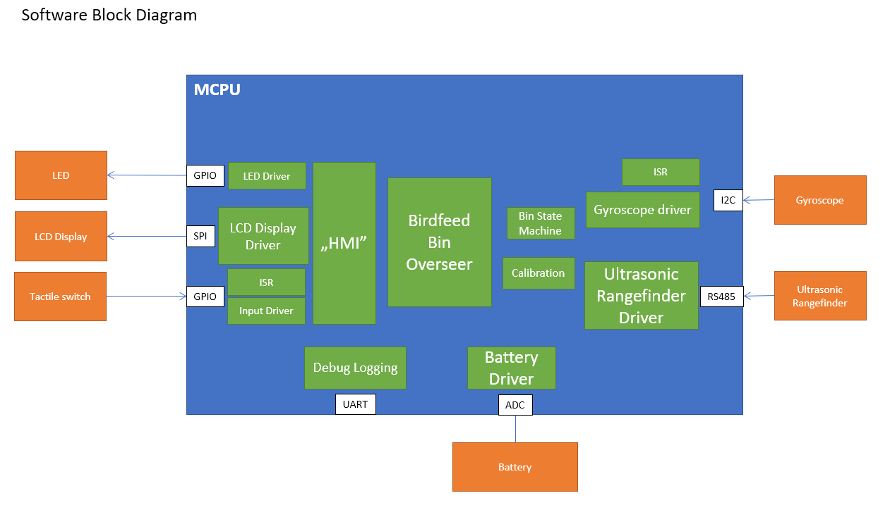

# Exercise 1: Idea project diagram

## Birdfeed Bin Overseer

The idea behind this project is to provide information on the status of the
birdfeed bin, so one could easily keep up with the levels of birdfeed and
monitor the necessity to order fresh seed. Birdfeed Bin Overseer should be easy
to mount up on any bin, in which one could keep the seeds.

### About the project
The base of the Birdfeed Bin Overseer is the ultrasonic rangefinder sensor,
which provides the user with the distance between the bin lid and the seeds kept
in the bin. The user should calibrate the rangefinder everytime the device is
turned off and on (e.g. because of battery discharge). The calibration will also
ensure that the device is usable with different containers.

The seed levels are measured when the bin lid is closed - the device wakes up
from sleep and performs the measurement. At this point, the user can read the
seed levels from the 2 line LCD screen. 

The LCD screen readout also provides the information on the battery charge
level.

The device will alert the user in the following scenarios:
- the birdfeed is finished
- it is time to order fresh birdfeed, based on the previous data (usage and
  previous refills)
- battery needs to be recharged

The user will be notified via the LCD screen readout and blinking led.

### Architecture

||
|:--:|
| *Figure 1. Software block diagram of the Birdfeed Bin Overseer*|

||
|:--:|
| *Figure 2. Software hierarchy diagram of the Birdfeed Bin Overseer*|
