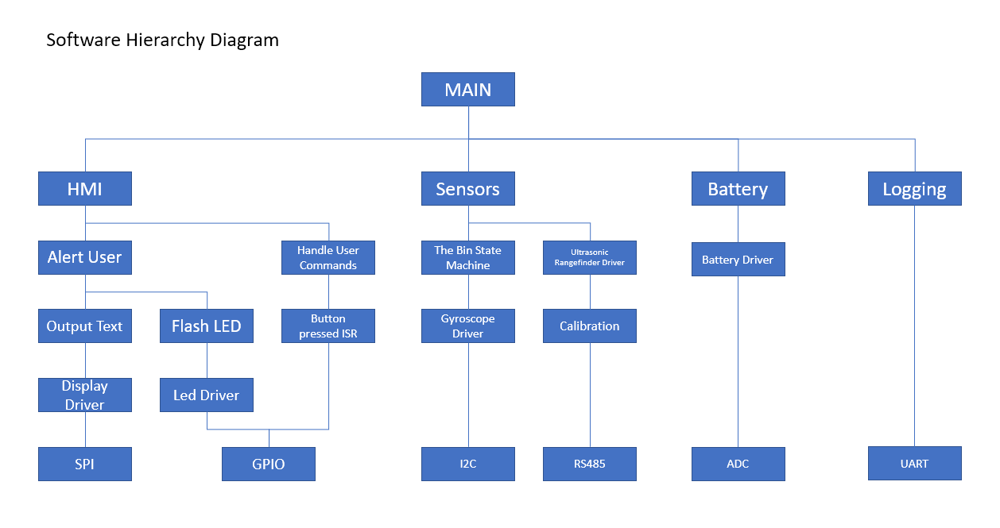

# Exercise 1: Idea project diagram

## Birdfeed Bin Overseer
If you are someone who likes feeding birds in your garden, you probably already
have a container for the seeds and nuts. But your bin is not smart at all. In
the 21st century, one needs to have "smart" IoT appliances, therefore: Birdfeed
Bin Overseer.

The idea behind it is to provide the level of bird feed in the bin and monitor
the necessity to order fresh seeds from the store before it runs out. The device
should be easy to mount on any bin or container to satisfy the market's niche.

### About the project
The base of the Birdfeed Bin Overseer is the ultrasonic rangefinder sensor,
which provides the user with the distance between the bin lid and the seeds kept
in the bin. The user should calibrate the rangefinder everytime the device is
turned off and on (e.g. because of battery discharge). The calibration will also
ensure that the device is usable with different containers.

The seed levels are measured when the bin lid is closed - the device wakes up
from sleep and performs the measurement. At this point, the user can read the
seed levels from the 2 line LCD screen. 

The LCD screen readout also provides the information on the battery charge
level.

The device will alert the user in the following scenarios:
- the birdfeed is finished
- it is time to order fresh birdfeed, based on the previous data (usage and
  previous refills)
- battery needs to be recharged

The user will be notified via the LCD screen readout and blinking led.

### Architecture

||
|:--:|
| *Figure 1. Software block diagram of the Birdfeed Bin Overseer*|

||
|:--:|
| *Figure 2. Hierarchy of control diagram of the Birdfeed Bin Overseer*|
