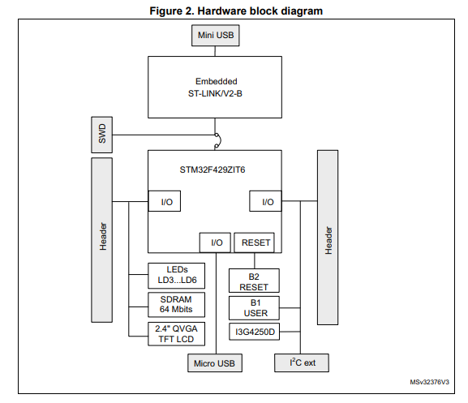

# Exercise 2: Investigate Project Boards

Comparison of 32F429IDISCOVERY and LPCXpresso55S69

## Comparison

|                             | 32F429IDISCOVERY                                                                                             | LPCXpresso55S69                                                                                              |
|-----------------------------|--------------------------------------------------------------------------------------------------------------|--------------------------------------------------------------------------------------------------------------|
| Processor                   | STM32F429ZIT6                                                                                                | LPC55S6x                                                                                                     |
| Flash memory                | 2 Mbytes internal                                                                                            | 640 Kbytes internal                                                                                          |
| RAM memory                  | 256 Kbytes internal + 4 Kbytes of backup SRAM internal; 8 Mbytes SDRAM on-board                              | 320 Kbytes SRAM (32KB on Code Bus; 272 KB on System Bus - contiguous; + additional 16 KB USB SRAM) internal; |
| ADC + features              | 3 x 12-bit, 2.4 million samples per second (MSPS) ADC                                                        | 1 x 16-bit (five differential channel pair or 10 single-ended channels), 1 MSPS ADC                          |
| Board cost and availability | ~$50 Kamami.pl and Botland.com.pl; $76.99 on Amazon; ~$30 directly from ST, Digi-Key, Mouser, RS Components  | ~$42 Farnell; ~$66 Kamami.pl; ~$53 RS Components                                                             |
| MCPU cost and availability  | ~$35 Kamami.pl; Arrow $10/500pcs; ~20 from ST - out of stock everywhere                                      | ~$12 Farnell (available as a purchase order) - not available anywhere                                        |
| Peripherals                 | 2.4" QVGA TFT LCD; 64-Mbit SDRAM; ST MEMS 3-axis gyroscope (I3G4250D); 2 user LEDs; 1 user push-button       | Micro SD Card slot; NXP accelerometer (MMA8652FCR1); Audio codec with line in; 3x User LEDs                  |

## 32F429IDISCOVERY
||
|:--:|
|*Figure: HW Diagram stolen from the datasheet - UM1670 Rev 5 p.10.* |

- [Discovery Kit Data Brief](https://www.st.com/resource/en/data_brief/32f429idiscovery.pdf)
- [Discovery Kit User Manual - UM1670](https://www.st.com/resource/en/user_manual/um1670-discovery-kit-with-stm32f429zi-mcu-stmicroelectronics.pdf)
- [STM32F429I-DISC1 schematics](https://www.st.com/content/ccc/resource/technical/layouts_and_diagrams/schematic_pack/group1/34/bf/e8/b2/24/ae/4a/a4/MB1075-F429I-E01_Schematic/files/MB1075-F429I-E01_Schematic.pdf/jcr:content/translations/en.MB1075-F429I-E01_Schematic.pdf)
- [STM32F429ZIT6U MCPU Datasheet](https://www.st.com/resource/en/datasheet/stm32f429ng.pdf)
- [Cortex-M3 Technical Reference Manual](https://documentation-service.arm.com/static/5e8e107f88295d1e18d34714?token=)

## LPCXpresso55S69

- [LPCXpresso55S69 Development Board User Manual](https://www.nxp.com/webapp/Download?colCode=UM11158)
- [MCPU Datasheet](https://www.mouser.cn/datasheet/2/302/LPC55S6x-1536969.pdf)
